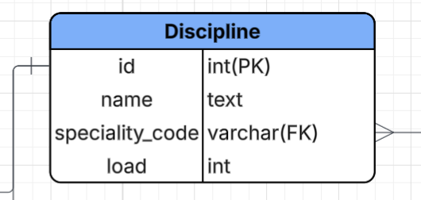
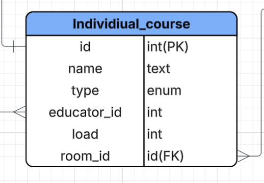

# Лабораторная №2.1
## Предметная область - Деканат
База данных создана для университетского портала, который смогут использовать студенты и преподаватели для быстрого и простого получения информации об учебном процессе (расписания, оценки, размер стипендии и т.д.)
## Таблицы
### Таблица "Student"

- id - уникальный идентификатор студента (первичный ключ)
- account_id - идентификатор аккаунта студента (внешний ключ связан с таблицей Account через поле id, связь один к одному)
- acception_date - дата поступления студента в университет
- group_id - идентификатор группы, в которой учится студент (внешний ключ связан с таблицей Academic_group через поле id, связь многие к одному)
- education_id - идентификатор в таблице education (внешний ключ связан с таблицей Education через поле id, связь многие к одному)
- stipend_type - тип стипендии студента (внешний ключ связан с таблицей Stipend через поле type, связь многие к одному)
- status_id - cтатус студента (активен, отчислен, закончил) (внешний ключ связан с таблицей Educational_status через поле status, связь многие к одному)

### Таблица "Educator"

- id - уникальный идентификатор преподавателя (первичный ключ)
- account_id - идентификатор аккаунта преподавателя (внешний ключ связан с таблицей Account через поле id, связь один к одному)
- degree - ученая степень преподавателя

### Таблица "Account"

- id - уникальный идентификатор аккаунта (первичный ключ)
- login - логин аккаунта
- password - пароль аккаунта (хранится в виде хэша)
- first_name - имя студента/преподавателя
- last_name - фамилия студента/преподавателя
- birth_date - дата рождения студента/преподавателя
- email - электронная почта аккаунта
- phone - номер телефона аккаунта
- status - права аккаунта (студент, преподаватель)

### Таблица "Score"

- discipline_id - идентификатор дисциплины (внешний ключ связан с таблицей Discipline через поле id, связь многие к одному)
- educator_id - идентификатор преподавателя, поставившего оценку (внешний ключ связан с таблицей Educator через поле id, связь многие к одному)
- student_id - идентификатор студента, которому поставлена оценка (внешний ключ связан с таблицей Student через поле id, связь многие к одному)
- score_value - значение оценки
- term - семестр, в котором была поставлена оценка

### Таблица "Stipend"

- type - тип стипендии (первичный ключ)
- amount - размер стипендии

### Таблица "Author"

Ассоциативная таблица для связи многие ко многим между таблицами Educator и Article

- educator_id - идентификатор преподавателя (внешний ключ связан с таблицей Educator через поле id, связь многие к одному)
- doi - идентификатор статьи (внешний ключ связан с таблицей Article через поле id, связь многие к одному)

### Таблица "Article"

- doi - уникальный идентификатор статьи (первичный ключ)
- name - название статьи
- publish_date - дата публикации статьи
- publishing - издательство, в котором была опубликована статья

### Таблица "Discipline"

- id - уникальный идентификатор дисциплины (первичный ключ)
- name - название дисциплины
- speciality_code - код специальности, к которой относится дисциплина
- load - нагрузка по дисциплине (в часах)

### Таблица "Academic_group"

- id - уникальный идентификатор группы (первичный ключ)
- group_number - номер группы
- speciality_code - код специальности, к которой относится группа (внешний ключ связан с таблицей Speciality через поле speciality_code, связь многие к одному)

### Таблица "Lesson_group"

Ассоциативная таблица для связи многие ко многим между таблицами Academic_group и Lesson

- lesson_id - идентификатор занятия (внешний ключ связан с таблицей Lesson через поле id, связь многие к одному)
- group_id - идентификатор группы (внешний ключ связан с таблицей Academic_group через поле id, связь многие к одному)

### Таблица "Lesson"

- id - уникальный идентификатор занятия (первичный ключ)
- day - день недели, в который проводится занятие
- scheduled_start - запланированное время начала занятия
- scheduled_end - запланированное время окончания занятия
- discipline_id - идентификатор дисциплины, по которой проводится занятие (внешний ключ связан с таблицей Discipline через поле id, связь многие к одному)
- educator_id - идентификатор преподавателя, проводящего занятие (внешний ключ связан с таблицей Educator через поле id, связь многие к одному)
- room_id - идентификатор аудитории, в которой проводится занятие (внешний ключ связан с таблицей Room через поле id, связь многие к одному)
- parity - четность недели (все, четная, нечетная)

### Таблица "Education"

- id - уникальный идентификатор формы обучения (первичный ключ)
- speciality_code - код специальности (внешний ключ связан с таблицей Speciality через поле speciality_code, связь многие к одному)
- basis - форма обучения (бюджет, контракт)
- type - тип обучения (очная, заочная, вечерняя)

### Таблица "Speciality"

- speciality_code - уникальный код специальности (первичный ключ)
- name - название специальности
- quota - количество бюджетных мест по специальности
- faculty_id - идентификатор факультета, к которому относится специальность (внешний ключ связан с таблицей Faculty через поле id, связь многие к одному)

### Таблица "Faculty"

- id - уникальный идентификатор факультета (первичный ключ)
- name - название факультета
- dean - декан факультета (внешний ключ связан с таблицей Educator через поле id, связь один к одному)

### Таблица "Educational_status"

- id - уникальный идентификатор статуса (первичный ключ)
- term - текущий семестр студента
- valid_from - дата начала действия статуса
- valid_to - дата окончания действия статуса
- status - статус студента (активен, отчислен, закончил)

### Таблтица "Course_registration"

Ассоциативная таблица для связи многие ко многим между таблицами Student и Individual_course

- student_id - идентификатор студента (внешний ключ связан с таблицей Student через поле id, связь многие к одному)
- course_id - идентификатор курса (внешний ключ связан с таблицей Individual_course через поле id, связь многие к одному)
- term - семестр, в котором студент записался на курс
- score_value - оценка, полученная студентом за курс

### Таблица "Individual_course"

- id - уникальный идентификатор курса (первичный ключ)
- name - название курса
- type - тип курса (МФК, МФК по ИИ, спецкурс и т.д.)
- educator_id - идентификатор преподавателя, ведущего курс (внешний ключ связан с таблицей Educator через поле id, связь многие к одному)
- load - нагрузка по курсу (в часах)
- room_id - идентификатор аудитории, в которой проводится курс (внешний ключ связан с таблицей Room через поле id, связь многие к одному)

### Таблица "Building"

- id - уникальный идентификатор корпуса (первичный ключ)
- address - адрес корпуса
- name - название корпуса

### Таблица "Room"

- id - уникальный идентификатор аудитории (первичный ключ)
- name - название аудитории
- building_id - идентификатор корпуса, в котором находится аудитория (внешний ключ связан с таблицей Building через поле id, связь многие к одному)
- capacity - вместимость аудитории

## Сценарии использования
1. Посмотреть оценки за определенный семестр. Оценки достаются из таблицы Score, где student_id соответствует текущему пользователю, а term - выбранному семестру.
2. Просмотр расписания в любой день недели. Таблица Student связывается с таблицей Academic_group через поле group_id, затем таблица Academic_group связывается с таблицей Lesson_group через поле id, и, наконец, таблица Lesson_group связывается с таблицей Lesson через поле lesson_id. Фильтрация по дню недели осуществляется в таблице Lesson через поле day.
3. Просмотр пар, на которые назначен преподаватель. Таблица Educator связывается с таблицей Lesson через поле id, затем фильтрация по преподавателю осуществляется в таблице Lesson через поле educator_id.
4. Просмотр информации о факультетах и специальностях. Можно просмотреть все факультеты из таблицы Faculty, а затем для каждого факультета можно получить связанные специальности из таблицы Speciality через поле faculty_id.
5. Просмотр информации о статьях, написанных преподавателем. Таблица Educator связывается с таблицей Author через поле id, затем таблица Author связывается с таблицей Article через поле article_id.
6. Для студента можно автоматически рассчитать средний балл за семестр и на его основе определить размер стипендии. Средний балл рассчитывается на основе оценок из таблицы Score, где student_id соответствует текущему пользователю, а term - выбранному семестру. В зависимости от среднего балла выбирается stipend_type, и на его основе из таблицы Stipend получается размер стипендии.

## Пример добавления данных в базу данных
Предположим, что на специальность пришли студенты-первокурсники, и нужно добавить их в базу данных. Предварительно, после распределения по группам, были добавлены записи в Academic_group. Для Academic_group из внешних ключей необходимо указать speciality_code, который уже существует в таблице Speciality. Затем регистрируем студента в университетском портале, создавая запись в таблице Account. После этого добавляем запись в таблицу Student, указывая account_id из только что созданной записи в Account, а также group_id из существующей записи в Academic_group и education_id из существующей записи в Education.
